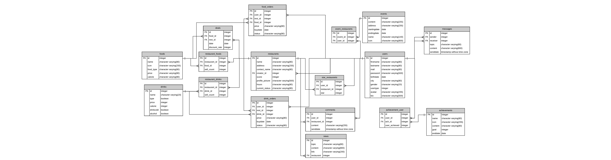

Developer Guide
===============

Database Design
---------------
Our project brings opportunities of Yemeksepeti, Zomato, and Facebook together.restaurant owners can display their restaurants and share information about them, while customers can look at restaurants' menus, rate them and order from them.
As customers order from restaurants and visit them, they can unlock achievements.Moreover, Restoranlandın shares events from the world of taste on the home page to inform people and tempt them to join. To make these possible our database has
many tables which are Achievements, Deals, Drinks, Events, Food Orders, Drink Orders, Messages, News, Restaurants, and Users. These tables are our main tables and each one of them consists of different attributes. Apart from these tables, our database has
minor tables to connect bigger ones.

Our E/R diagram of the project:

We initialized our database with initdb function which is given below:

.. code-block:: python

      @site.route('/initdb')
      @login_required
      def initialize_database():
          user = load_user(current_user.get_id())
          if not user.is_admin :
              abort(401)

          with dbapi2.connect(current_app.config['dsn']) as connection:
              cursor = connection.cursor()

              query = """DROP TABLE IF EXISTS ACHIEVEMENT_USER"""
              cursor.execute(query)

              query = """DROP TABLE IF EXISTS NEWS;"""
              cursor.execute(query)

              query = """DROP TABLE IF EXISTS MESSAGES;"""
              cursor.execute(query)

              query = """DROP TABLE IF EXISTS RESTAURANT_FOODS;"""
              cursor.execute(query)

              query = """DROP TABLE IF EXISTS STAR_RESTAURANTS;"""
              cursor.execute(query)

              query = """DROP TABLE IF EXISTS RESTAURANT_DRINKS;"""
              cursor.execute(query)

              query = """DROP TABLE IF EXISTS ACHIEVEMENTS;"""
              cursor.execute(query)

              query = """DROP TABLE IF EXISTS COMMENTS;"""
              cursor.execute(query)

              query = """DROP TABLE IF EXISTS EVENT_RESTAURANTS;"""
              cursor.execute(query)

              query = """DROP TABLE IF EXISTS EVENTS;"""
              cursor.execute(query)

              query = """DROP TABLE IF EXISTS DEALS;"""
              cursor.execute(query)

              query = """DROP TABLE IF EXISTS FOOD_ORDERS;"""
              cursor.execute(query)

              query = """DROP TABLE IF EXISTS DRINK_ORDERS;"""
              cursor.execute(query)

              query = """DROP TABLE IF EXISTS DRINKS;"""
              cursor.execute(query)

              query = """DROP TABLE IF EXISTS RESTAURANTS;"""
              cursor.execute(query)

              query = """DROP TABLE IF EXISTS FOODS;"""
              cursor.execute(query)

              query = """DROP TABLE IF EXISTS USERS;"""

              cursor.execute(query)

              query = """CREATE TABLE USERS (
              ID SERIAL PRIMARY KEY,
              FIRSTNAME VARCHAR(80) NOT NULL,
              LASTNAME VARCHAR(80) NOT NULL,
              MAIL VARCHAR(80) NOT NULL,
              PASSWORD VARCHAR(500) NOT NULL,
              BIRTHDATE DATE NOT NULL,
              CITY VARCHAR(80) NOT NULL,
              GENDER VARCHAR(20),
              USERTYPE INTEGER NOT NULL,
              AVATAR VARCHAR(255),
              BIO VARCHAR(500) NOT NULL
              );"""
              cursor.execute(query)

              query = """CREATE TABLE FOODS (
                 ID SERIAL PRIMARY KEY,
                 NAME VARCHAR(80) NOT NULL,
                 ICON VARCHAR(255) NOT NULL,
                 FOOD_TYPE VARCHAR(80) NOT NULL,
                 PRICE VARCHAR(80) NOT NULL,
                 CALORIE VARCHAR(80) NOT NULL
              );"""
              cursor.execute(query)

              query = """CREATE TABLE RESTAURANTS (
                 ID SERIAL PRIMARY KEY,
                 NAME VARCHAR(80) NOT NULL,
                 ADDRESS VARCHAR(255) NOT NULL,
                 CONTACT_NAME VARCHAR(80) NOT NULL,
                 CREATOR_ID INTEGER REFERENCES USERS(ID),
                 SCORE INTEGER NOT NULL DEFAULT 0 CHECK( SCORE >= 0 AND SCORE <= 5),
                 PROFILE_PICTURE VARCHAR(500) NOT NULL,
                 HOURS VARCHAR(80) NOT NULL,
                 CURRENT_STATUS VARCHAR(80) NOT NULL
              );"""
              cursor.execute(query)

              query = """CREATE TABLE DRINKS(
              ID SERIAL PRIMARY KEY,
              NAME VARCHAR(20) NOT NULL,
              TYPE BOOLEAN,
              PRICE INTEGER,
              CALORIE INTEGER,
              DRINKCOLD BOOLEAN,
              ALCOHOL BOOLEAN
              );"""
              cursor.execute(query)

              query = """CREATE TABLE RESTAURANT_FOODS (
                 ID SERIAL PRIMARY KEY,
                 RESTAURANT_ID INTEGER REFERENCES RESTAURANTS(ID) ON DELETE CASCADE,
                 FOOD_ID INTEGER REFERENCES FOODS(ID) ON DELETE CASCADE,
                 SELL_COUNT INTEGER NOT NULL
              );"""
              cursor.execute(query)

              query = """CREATE TABLE RESTAURANT_DRINKS (
                 ID SERIAL PRIMARY KEY,
                 RESTAURANT_ID INTEGER  REFERENCES RESTAURANTS(ID) ON DELETE CASCADE,
                 DRINK_ID INTEGER  REFERENCES DRINKS(ID) ON DELETE CASCADE,
                 SELL_COUNT INTEGER NOT NULL
              );"""
              cursor.execute(query)

              query = """CREATE TABLE ACHIEVEMENTS (
                 ID SERIAL PRIMARY KEY,
                 NAME VARCHAR(80) NOT NULL,
                 ICON VARCHAR(255) NOT NULL,
                 CONTENT VARCHAR(80) NOT NULL,
                 GOAL INTEGER NOT NULL,
                 ENDDATE DATE NOT NULL
              );"""
              cursor.execute(query)

              query = """CREATE TABLE COMMENTS (
                 ID SERIAL PRIMARY KEY,
                 USER_ID INTEGER REFERENCES USERS(ID) ON DELETE CASCADE,
                 RESTAURANT_ID INTEGER REFERENCES RESTAURANTS(ID) ON DELETE CASCADE,
                 CONTENT VARCHAR(255) NOT NULL,
                 SENDDATE TIMESTAMP NOT NULL
              );"""
              cursor.execute(query)

              query = """CREATE TABLE STAR_RESTAURANTS(
                  ID SERIAL PRIMARY KEY,
                  USER_ID INTEGER REFERENCES USERS(ID) ON DELETE CASCADE,
                  RESTAURANT_ID INTEGER REFERENCES RESTAURANTS(ID) ON DELETE CASCADE,
                  STAR INTEGER NOT NULL
              )
              """
              cursor.execute(query)

              query = """CREATE TABLE MESSAGES (
              ID SERIAL PRIMARY KEY,
              SENDER INTEGER REFERENCES USERS(ID) ON DELETE CASCADE,
              RECEIVER INTEGER REFERENCES USERS(ID) ON DELETE CASCADE,
              TOPIC VARCHAR(80) NOT NULL,
              CONTENT VARCHAR(800) NOT NULL,
              SENDDATE TIMESTAMP NOT NULL
              );"""
              cursor.execute(query)

              query = """CREATE TABLE EVENTS(
              ID SERIAL PRIMARY KEY,
              CONTENT VARCHAR(255) NOT NULL,
              ADDRESS VARCHAR(255) NOT NULL,
              STARTINGDATE DATE NOT NULL,
              ENDINGDATE DATE NOT NULL,
              NAME VARCHAR(140) NOT NULL,
              ICON VARCHAR(800)
              );"""

              cursor.execute(query)

              query = """CREATE TABLE DEALS (
              ID SERIAL PRIMARY KEY,
              FOOD_ID INTEGER REFERENCES FOODS(ID) ON DELETE CASCADE,
              REST_ID INTEGER REFERENCES RESTAURANTS(ID) ON DELETE CASCADE,
              DATE DATE NOT NULL,
              DISCOUNT_RATE INTEGER NOT NULL CHECK(DISCOUNT_RATE >= 0 AND DISCOUNT_RATE <= 100)
              );"""
              cursor.execute(query)

              query = """CREATE TABLE EVENT_RESTAURANTS (
                  ID SERIAL PRIMARY KEY,
                  EVENT_ID INTEGER REFERENCES EVENTS(ID) ON DELETE CASCADE,
                  USER_ID INTEGER REFERENCES USERS(ID) ON DELETE CASCADE
                  );"""
              cursor.execute(query)

              query = """CREATE TABLE FOOD_ORDERS (
              ID SERIAL PRIMARY KEY,
              USER_ID INTEGER REFERENCES USERS(ID) ON DELETE CASCADE,
              REST_ID INTEGER REFERENCES RESTAURANTS(ID) ON DELETE CASCADE,
              FOOD_ID INTEGER REFERENCES FOODS(ID) ON DELETE CASCADE,
              PRICE VARCHAR(80) NOT NULL,
              BUYDATE DATE NOT NULL,
              STATUS VARCHAR(80) NOT NULL
              );"""
              cursor.execute(query)

              query = """CREATE TABLE DRINK_ORDERS (
              ID SERIAL PRIMARY KEY,
              USER_ID INTEGER REFERENCES USERS(ID) ON DELETE CASCADE,
              REST_ID INTEGER REFERENCES RESTAURANTS(ID) ON DELETE CASCADE,
              DRINK_ID INTEGER REFERENCES DRINKS(ID) ON DELETE CASCADE,
              PRICE VARCHAR(80) NOT NULL,
              BUYDATE DATE NOT NULL,
              STATUS VARCHAR(80) NOT NULL
              );"""
              cursor.execute(query)

              query = """CREATE TABLE NEWS (
              ID SERIAL PRIMARY KEY,
              TOPIC VARCHAR(80) NOT NULL,
              CONTENT VARCHAR(800) NOT NULL,
              LINK VARCHAR(200),
              RESTAURANT INTEGER REFERENCES RESTAURANTS(ID) ON DELETE CASCADE
              );"""

              cursor.execute(query)
              query = """CREATE TABLE ACHIEVEMENT_USER (
              ID SERIAL PRIMARY KEY,
              USER_ID INTEGER REFERENCES USERS(ID) ON DELETE CASCADE,
              ACH_ID INTEGER REFERENCES ACHIEVEMENTS(ID) ON DELETE CASCADE,
              USER_ACHIEVED INTEGER NOT NULL
              );"""
              cursor.execute(query)

              connection.commit()

              query = """
                     INSERT INTO USERS (FIRSTNAME, LASTNAME, MAIL, PASSWORD, BIRTHDATE, CITY,GENDER,USERTYPE,AVATAR,BIO)
                          VALUES (%s,%s,%s,%s,%s,%s,%s,%s,%s,%s)"""

              hashed_password = pwd_context.encrypt("12345")
              cursor.execute(query, ("admin", "admin", "admin@restoranlandin.com", hashed_password, "2012-10-10", "","",0,"avatar",""))
              connection.commit()

              #Add achievements.
              query = """
                      INSERT INTO ACHIEVEMENTS (NAME, ICON, CONTENT, GOAL, ENDDATE)
                          VALUES (%s,%s,%s,%s,%s)"""
              cursor.execute(query,["First Order","", "Give your first order from any restaurant.", "1", "2020-10-10"])
              connection.commit()

              query = """
                      INSERT INTO ACHIEVEMENTS (NAME, ICON, CONTENT, GOAL, ENDDATE)
                          VALUES (%s,%s,%s,%s,%s)"""
              cursor.execute(query,["Carnivorous","", "Give 10 orders", "10", "2020-10-10"])
              connection.commit()

              query = """
                      INSERT INTO ACHIEVEMENTS (NAME, ICON, CONTENT, GOAL, ENDDATE)
                          VALUES (%s,%s,%s,%s,%s)"""
              cursor.execute(query,["Eating Less","", "Give 10 orders that includes meat.", "10", "2020-10-10"])
              connection.commit()

              return redirect(url_for('site.home_page'))

.. toctree::

   member1
   member2
   member3
   member4