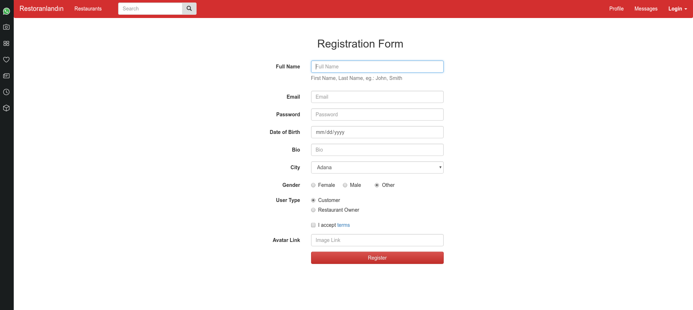
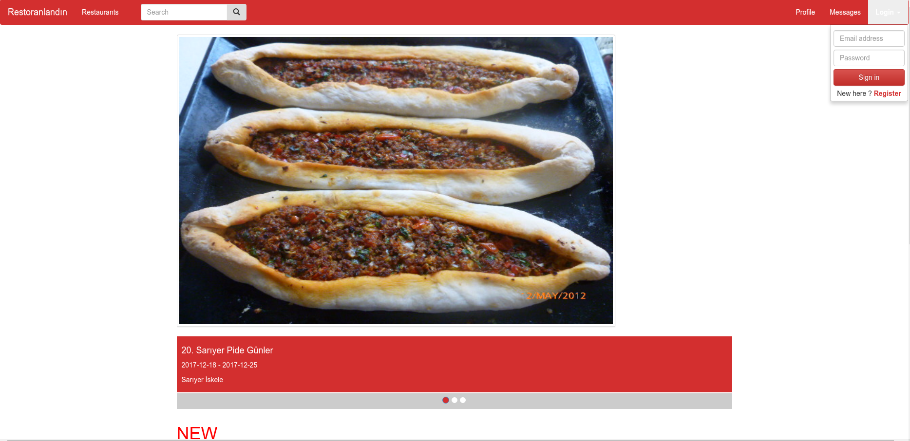
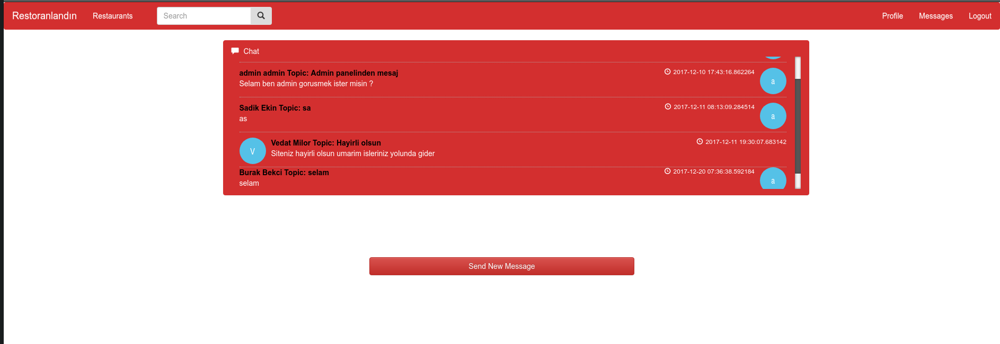
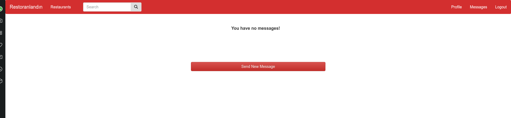
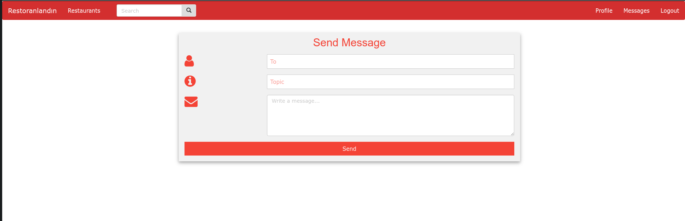
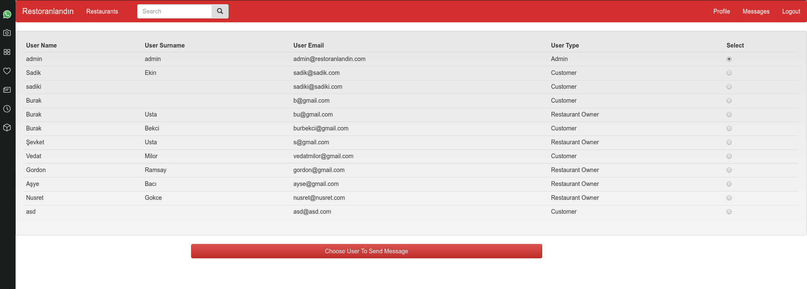
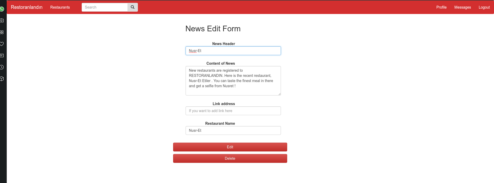
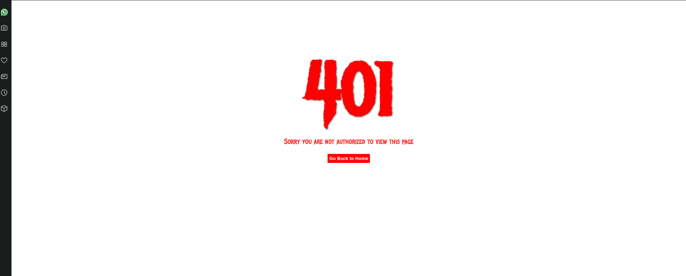

Parts Implemented by Alperen Kantarcı
================================
Profile login part of the navbar, user registration page,news edit page, message conversation, new message page for user and as an admin choosing user for message pages implented by Alperen Kantarcı. 

User Registration Page
------------------------------

     User creation page

This is the user registration page. We have two types of user which gives different abilities according to the type. If you are restaurant owner you will have a special page for adding one of your restaurants, creating a menu for your restaurants, adding foods or drinks to the menu of your restaurants with a price tag that you will decide, creating deals to attract attention of customers. If you are customer than you will have lots of exciting things such as achievements, your recent orders, ability to buy any food you want from any restaurant you want. In this registration form we want your name, email, password (we are protecting with high security don't worry), your birthday (we may make suprises for you), bio if you want give little introduction about you but it's not mandatory. If you want to have fancy avatar for your profile you can give link to us otherwise we will assign you default avatar. Now by clicking Register you are ready to use R E S T O R A N L A N D I N!

Login Page
----------------------------------

     Login from navbar

In order to make login easier we added little login button to the navbar. Whenever you click to the login button on the navbar from any page dropdown menu will be visible and if you are registered user by entering email and password you will be able to see and use impressive pages of us. If you are logged in login button magically evolve to the logout button. If you are not registered user you can click register button and be a user of us.  

Messages Page
-----------------

     User with messages

     User without messages

This is the page that you can see all your private messages that you send or get from restaurant owners, admin and customers. You can see who sent the message and when she or he sent it. Also you can see the messages that you sent to the other users as well. If you have no messages then there will be only sen new message button. 

New Message Page
------------------

     New Message Page

If you want to send private message to the admin, restaurant owner and customer than this is the page that you want. By giving topic and content you can send direct message to that user.

User Selecting Page 
----------------

     User selection for Admin

This is the page that only available for admin user since it contain's all users email and user types. When admin want to send message to the any user s/he can select from this page and send message as fast as possible

News Edit Page
-----------------------

     News Edit Page

Only admin can access this page by clicking header of the news on the home page. In this page admin either delete or update the news .

401 Unauthorized Error Page 
-----------------------

     401 Error Page

If you are trying to access a page that you are not authorized than you will see this page you can simply go to the homepage by clicking to the button.
