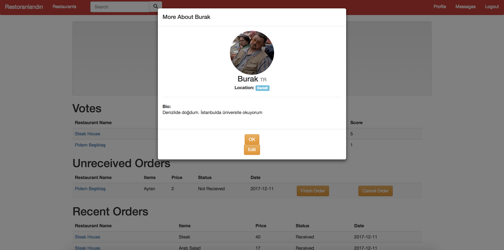

Parts Implemented by Onat Şahin
================================
Profile pages for regular users and restaurant owners, profile edit form, create and update forms for deals and achievements and search results page is implemented by Onat Şahin.

Profile Page for Regular Users
------------------------------

     Profile page for regular users.

     Drop down opens when the user clicks on the profile picture.

This is the profile page for regular users. A drop down opens when the user clicks on the profile picture, and the user can edit his/her information by clicking the edit button.
In the votes section, the user can see which restaurants he/she rated. Below that, unreceived orders section shows the orders which are still in progress. When the user gets his/her order,
he/she can click "finish order" to let the restaurant know that the order is delivered. By clicking the "cancel order" button, the user can cancel the order.
Below these the user can see his/her recent orders and completed achievements. In the page, by clicking the restaurant names, the user can go to that restaurants page.
However, because of a problem, if clicked on to a restaurant in the votes section, the list of restaurants show up.

Profile Page for Restaurant Owners
----------------------------------

     Profile Page for Restaurant Owners

This is the profile page for restaurant owners. The drop down that opens when clicked onto the profile picture in the regular user profile page exists in this page as well.
Below the profile picture, the user can see his/her restaurants listed in the restaurants section. Using the corresponding buttons, the user can add new restaurants, delete
existing restaurants and update existing restaurants.

Profile Edit Form
-----------------

     Profile Edit Form

This is the page that opens when clicked onto the "Edit" button in the dropdown. User's information is shown on the textboxes.
The user can rewrite the information in the textboxes can click the "Save changes" button to update his/her profile.

Deal Creation Form
------------------

     Deal Creation Form

This is the page that opens when a restaurant owner enters his/her restaurant and
clicks "Add deal" next to an item. The user can enter the information to create a deal.

Deal Update Form
----------------

     Deal Update Form

This is the page that opens when a restaurant owner click the "Update" button next to a deal in their restaurants.
The form is the same as creation form, the only difference being the current information is shown on the textboxes.

Achievement Create Form
-----------------------

     Achievement Create Form

This is the page that opens when the admin clicks "Create an achievement" button in the admin page. The admin can enter the information to create an achievement

Achievement Update Form
-----------------------

     Achievement Update Form

This is the page that opens when the admin clicks to an achievement. The form is the same as creation form, the only difference being the current information is shown on the textboxes.

Search Results Page
-------------------

     Search results page

This is the search results page that opens once a user searchs a word using the search bar in the navigation bar. Related restaurants and users are shown in different sections.
The user can click on the results to go to the page of that user or restaurant.
