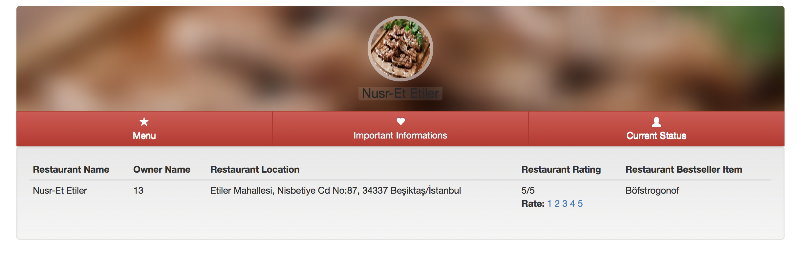
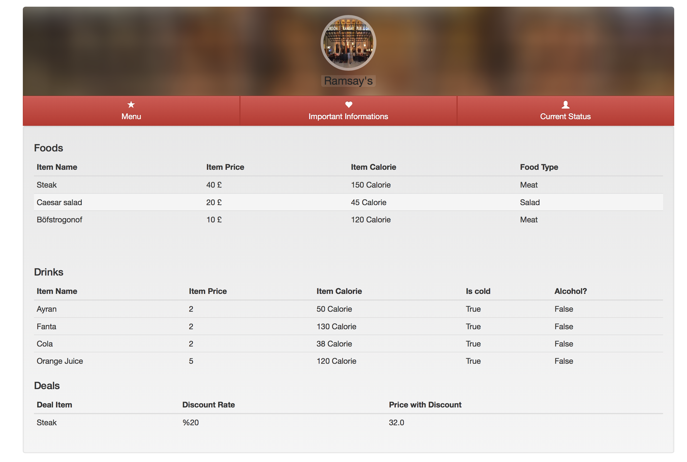
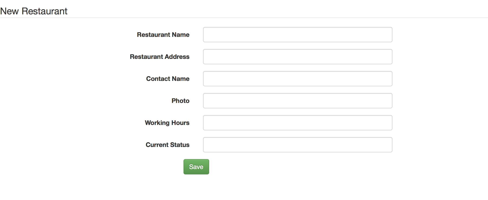
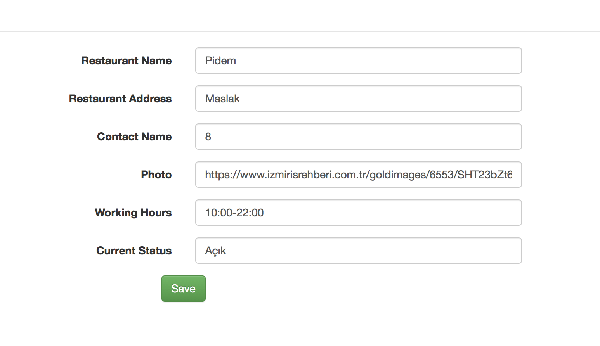
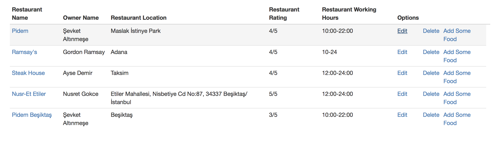
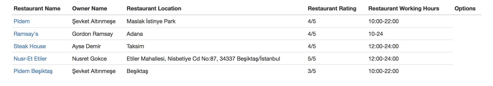
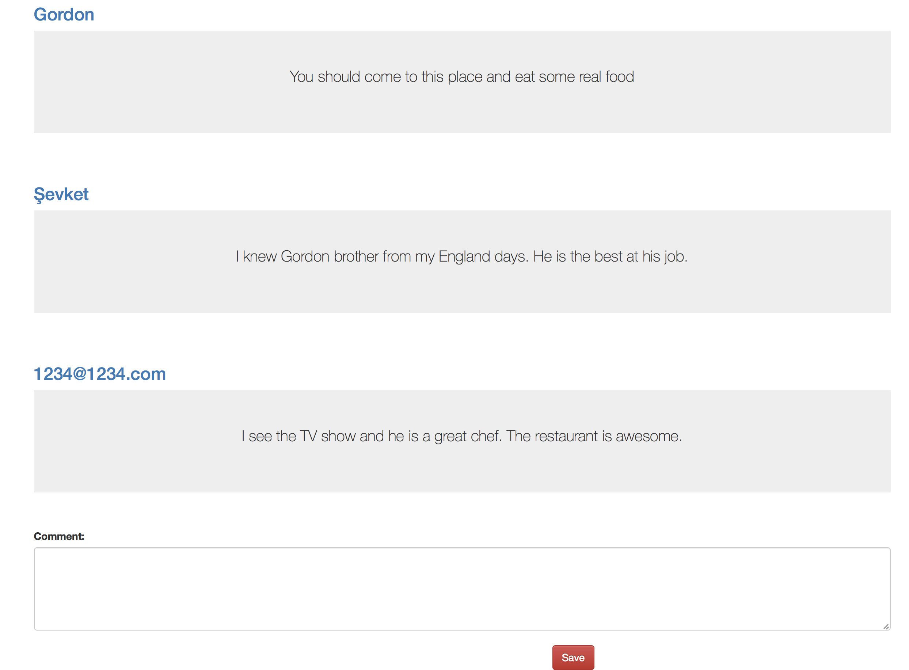
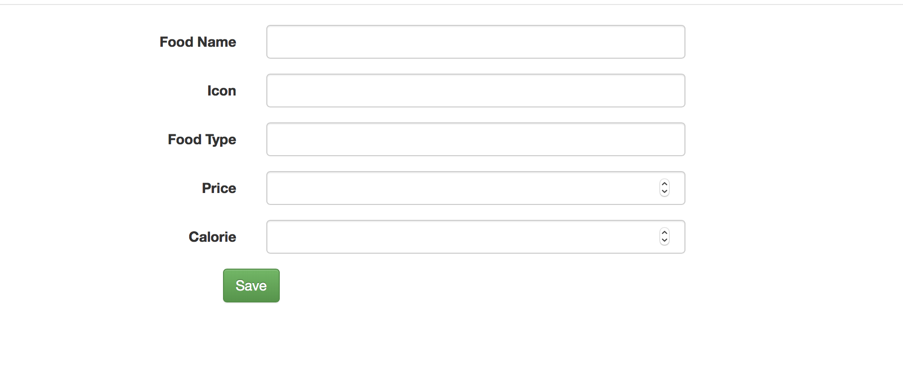
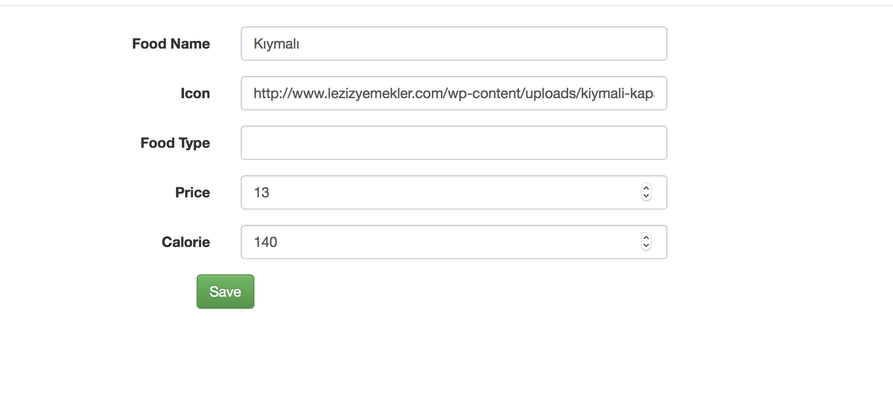
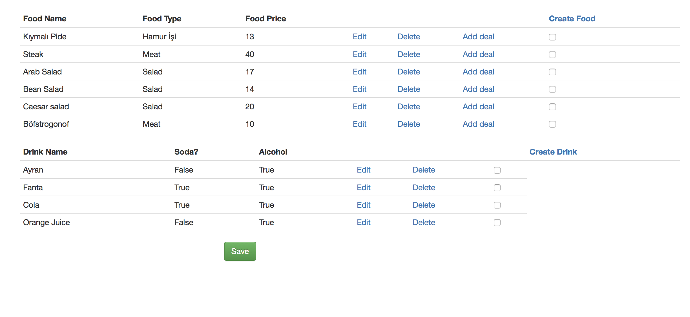

Parts Implemented by Sadık Ekin Özbay
=====================================
I was responsible for Restaurant, Food, and Comment. So I created the relationship between restaurant food and comment. For example, users can write a comment to a restaurant. Plus, restaurant owners can add foods to a restaurant. To sum up, I did database, python functions and HTML parts of Restaurant, Food, and Comment.

Restaurant Show Page
===================
.. figure:: images/ekin/restaurant_importantInfo.png
    :scale: 100 %
    :alt: restaurant important info show

Restaurant important info part contains owner name, location, rating, and bestseller item. Owner name and location is inside the database. I want to talk about rating and bestseller item. For rating, every user can vote just once. Not only the user but also admin cannot edit and delete votes. for bestseller item, I checked the orders.
Restaurant show status part contains only the status of the restaurant. If it is open or not.
Restaurant show menu part contains what the restaurant sells. Users can give a food order from here. Restaurant owners or admins can add foods or drinks to the restaurant. Or they can add deals to the foods.

Restaurant Edit and Create Page
===============================

Restaurant owners and admin can create the restaurant. They just need to fill the form on the create restaurant page. Furthermore, the admin user can edit all restaurants. However, restaurant owner user can edit only his/her restaurant. In edit page, information about the restaurant is filled. So, the user can see the values of that restaurant.

Restaurant Index Page
=====================

In this page, it changes with user type. If you are the admin user, you can see all restaurants edit delete and add food links. However, if you are restaurant owner user, you can see just your restaurant edit create and delete. By clicking the restaurant name of the list, the user can go that restaurants show page.

Comment Page
============

Users can give comments about any restaurant that they want. They can not edit their comments.Plus they cannot delete their comments.The admin user cannot delete or edit also.

Food Create and Edit Page
=========================

Only admin and restaurant owner create a food. We have food pool in our database. If restaurant owners cannot see their item on that list. They add the food, that they want in that food pool.
For editing, only admins or restaurant owners can edit the food. The information about that food is already filled in the page. Therefore, users can see what was the first value.

Add Food To The Restaurant Page
==============================

In this page, we can add foods to our restaurant. We just need to select the food from the checkbox and then hit the enter. Only admins can edit and delete foods. Burak Bekci is implemented the drink part of this page. User can add a deal to that food. Deal part is implemented by Onat Şahin
